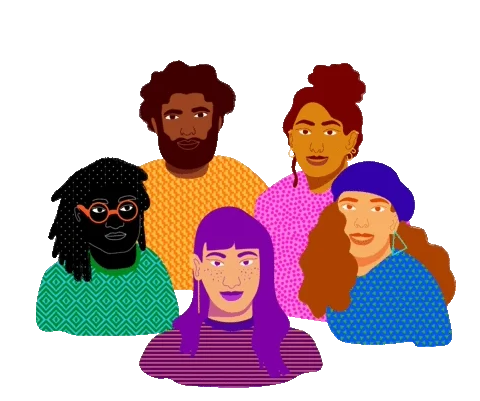

<!-- HERO SECTION -->

<h1 align="center">
    <b>
        Hi there, I'm Abhay Anand 
    </b>
    
</h1>

<!-- SOCIAL ACCOUNT -->

<p align="center">
<br>
    <a href="https://www.facebook.com/abhay.anand.792/">
        
    </a>&nbsp;
    <a href="https://www.instagram.com/hashtag_abhay/">
        
    </a>&nbsp;
    <a href="https://www.linkedin.com/in/abhay-anand1108/">
        
    </a>&nbsp;
    <a href="mailto:abhayanandkk23@gmail.com?subject=Konchiwa%20Abhay">
        
    </a>&nbsp;
    <a href="https://abhay-web-folio.netlify.app/">
        
    </a>&nbsp;
</p>

<!-- VIEW COUNT -->

<p align="center">
    
</p>

```javascript
const abhay = {
    pronouns: "He" | "Him",
    language: ["Javascript", "Python", "Java"],
    describeMe: ["web dev", "ui designer", "app dev", "techy"],
    technologies: {
        frontEnd: {
            vanilla: ["HTML5", "CSS3"],
            framework: ["ReactJS", "Gatsby"],
        },
        backEnd: {
            js: ["Node", "Fastify", "Express"],
        },
        mobileApp: {
            native: ["React Native", "JAVA Development"]
        },
        devOps: ["AWS"],
        databases: ["mongo", "MySql"],
        misc: ["Firebase", "Socket.IO"]
    },
    architecture: ["Progressive Web Applications", "Single Page Applications"],
    currentFocus: "Mobile App Development",
    funFact: "The first computer “bug” was an actual real-life bug"
};
```

---
<div>

    <em>
        <b>
             I love connecting with different people
        </b> 
        so if you want to say 
        <b>
            hi, I'll be happy to meet you more!
        </b>
        Drop any message in my social profile! 
    </em>
</div>

---

<!--START_SECTION:readme-info-->
<!--END_SECTION:readme-info-->


